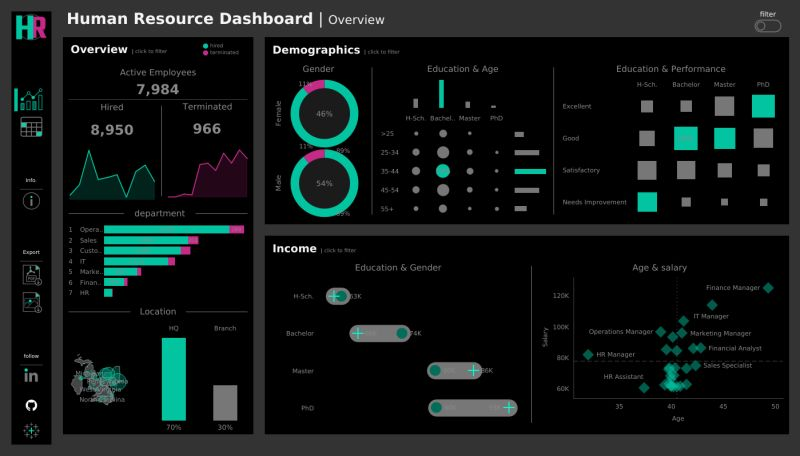
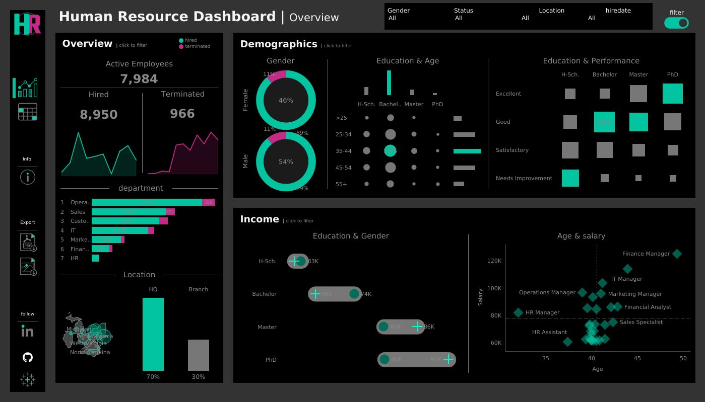
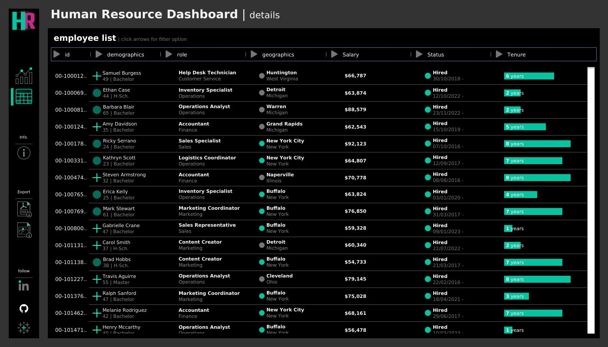
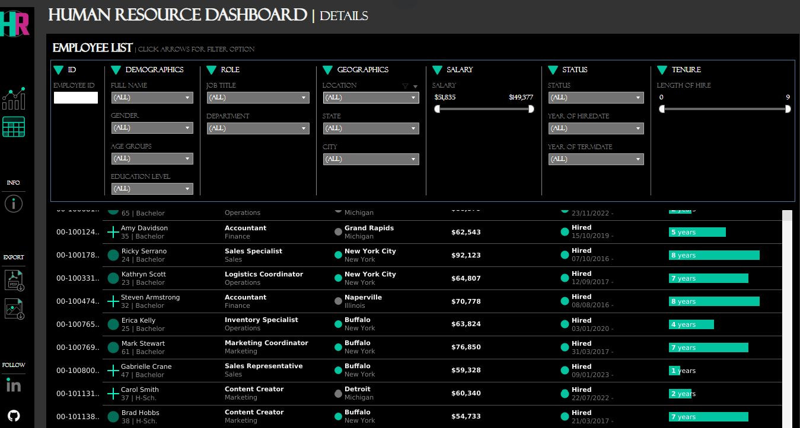

# 🚀 HR Dashboard Project 🚀

This repository documents an interactive Tableau dashboard I created to explore and visualize [domain - Human Resource ].

---
## 🌐 Live Dashboard

👉 [View it on Tableau Public](https://public.tableau.com/app/profile/hari.ravi6514/viz/HRdashboards_17223540029680/HRSummary)

## 🛠️ Dashboard Features

### 1. Navigation Panel  
- Located on the left side for easy navigation across dashboard sections  
- Info button and download options (PDF/Image)  
- Quick links to my LinkedIn, GitHub, and Tableau profiles  

---

### 2. Overview Dashboard

- **Overview Section**:  
  - Total active employees  
  - Area graph depicting hires and terminations from 2015 to 2024  
  - Department-wise hires and terminations  
  - Map highlighting hires and terminations by location  

- **Demographics Section**:  
  - Pie charts for male vs. female hires and terminations  
  - Comparison of education level vs. age groups  
  - Comparison of education level vs. performance  

- **Income Section**:  
  - Barbell chart illustrating gender and education level alongside salaries  
  - Department-wise comparison of age and salary  

---

### 3. Detailed Dashboard

Provides a detailed employee information table organized by employee ID with column-wise filters, including:

- **Personal Details**: Name, age, gender, education level  
- **Job Information**: Job title, department  
- **Location**: State and city for geographic workforce distribution  
- **Salary Information**: Detailed salary data for compensation analysis  
- **Employment Status**: Hire status (active/terminated), hire date, termination date, length of hire  

This flexible dashboard allows drill-down by any field — department, hire date, salary range, location, and more — enabling in-depth workforce analysis.

---

## 📸 Dashboard Preview

### Overview Dashboard  
   
*Summary of active employees, hires, terminations, demographics, and income.*

### Detailed Dashboard  
   
*Employee details with filters to explore specific data subsets.*

---
## 🛠 Tools Used
- Tableau Public
- Excel / CSV for data preparation

---

## ✍️ About Me  
**Haridhanush Ravichandran**  
MSc Data Science, University of Padova (2024–2026)  
🔗 [My Tableau Public Profile](https://public.tableau.com/app/profile/hari.ravi6514)

---

